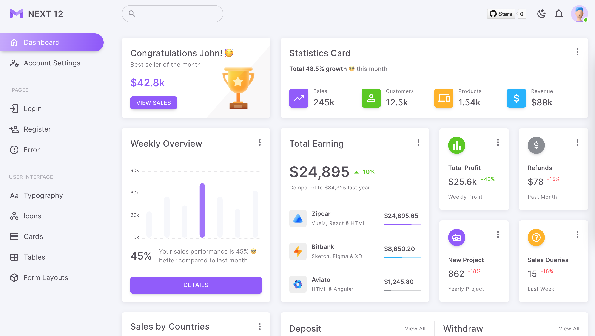

# React NextJS Admin Dashboard Template

## Feature
- Next.js 13
- React 18
- Typescript
- Material UI
- Redux and Redux toolkit
- SWR
- Jest and React testing library
- Husky, Prettier
- ESLint, Commitlint
- i18n, axios
- React hook form

## Demo page


[Link](https://next-js-template-cyan.vercel.app/)


## Available Scripts

In the project directory, you can run:

```
yarn
```

```
yarn start
```

```
yarn build
```

